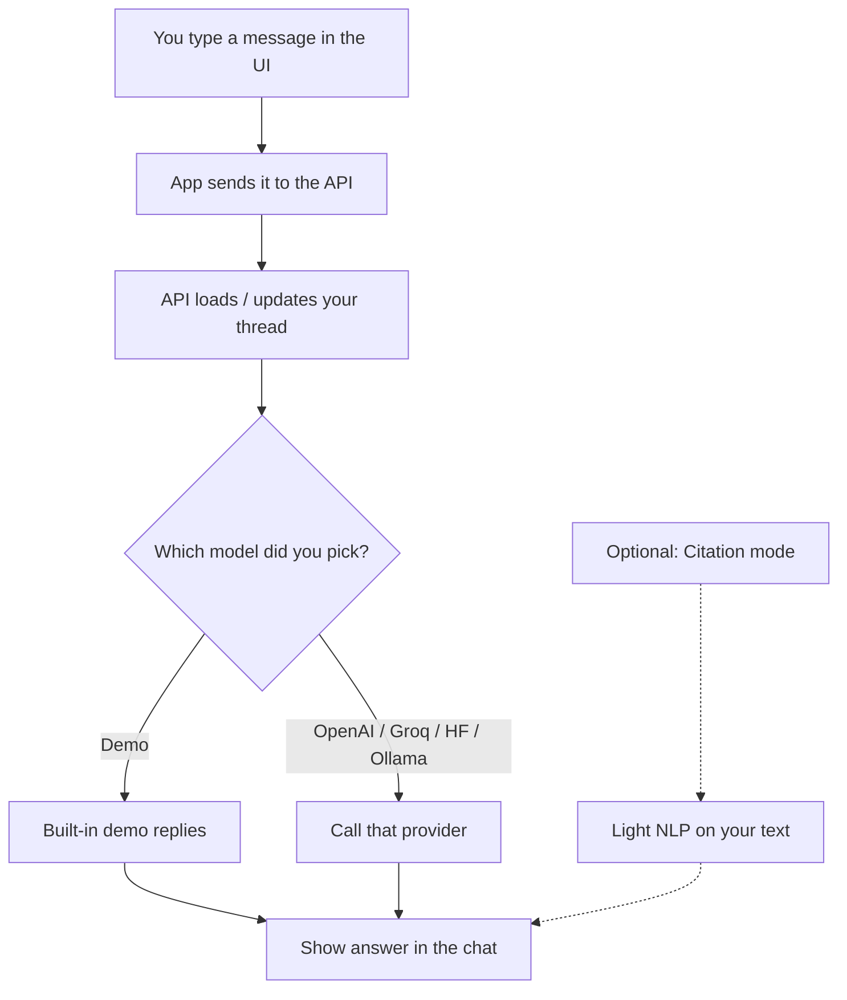
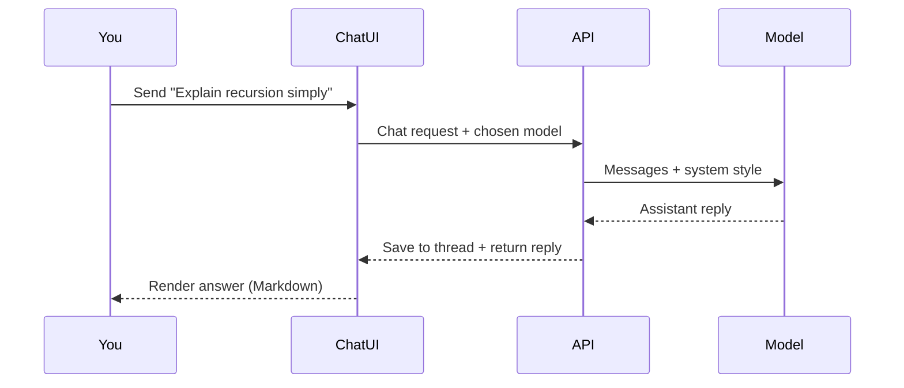

# Mini ChatGPT

**Author:** Hammad Durrani (HDxpert)  
**Live demo (static):** https://hammad-ml-dev.github.io/Mini-chatgpt/

---

## About this tool

This tool is a **ChatGPT-style chat workspace** you can run yourself. You create threads, pick a writing style, optionally turn on citation hints, and talk to an AI model — similar to using ChatGPT, but you control which brain answers:

| Mode | When to use it |
|------|----------------|
| **Demo** | Zero setup — try the UI without keys |
| **OpenAI** | Closest to ChatGPT quality (paid key) |
| **Ollama** | Free local models on your machine |
| **Groq** | Fast cloud open models (free tier) |
| **Hugging Face** | Hosted open models |

**Who it’s for**
- People who want their own ChatGPT-like app to explore  
- Recruiters who want to see a full chat product (not a single script)  
- Learners comparing providers behind one clean UI  

**Not the same as** [AI Customer Support Chatbot](https://github.com/hammad-ml-dev/Ai-customer-support-chatbot) — that one is a **helpdesk** for shoppers. This one is a **general chat** product.

---

## How a chat works



### Message path (easy view)



---

## What you can do in the app

- Start, switch, and delete **chat threads**  
- Choose a **model / provider** from the top bar  
- Pick writing style: balanced · code-focused · concise  
- Optional **Citation mode** (nudges careful sourcing + NLP keywords)  
- Attach text files into the prompt  

---

## Try it

1. **Static demo:** https://hammad-ml-dev.github.io/Mini-chatgpt/  
2. **Full app on your PC** (Demo mode works with no keys):

```bash
git clone https://github.com/hammad-ml-dev/Mini-chatgpt.git
cd Mini-chatgpt
copy .env.example .env
```

Terminal A — API:

```bash
cd server
npm install
npm run dev
```

Terminal B — UI:

```bash
cd client
npm install
npm run dev
```

Open http://localhost:5173  

Windows: double-click `scripts/dev-windows.bat` to start API + UI (+ optional NLP).

---

## Folder map

```
client/       Chat UI
server/       API · threads · model router
ml-service/   Optional NLP helper
docs/         Static GitHub Pages demo
scripts/      Windows starter
```

---

## Security note

`.env` is gitignored. If keys were ever committed in older history, **rotate them** in the provider consoles.

---

## Learning path

1. Use the static demo  
2. Run locally on **Demo** mode  
3. Read `server/src/llm/llmRouter.ts` — how the model dropdown picks a provider  
4. Add a Groq or OpenAI key and switch models  

---

## Built with

React · Express · optional FastAPI · OpenAI / Ollama / Groq / Hugging Face

---

MIT · Portfolio work by **Hammad Durrani**.
